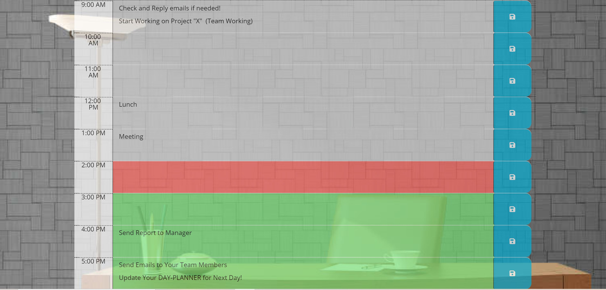

# Work Day Scheduler

This application allows users to schedule their time and save any event or activity for each hour of the day from 9:00 am to 5:00 pm.

There are three different situations with different colors:

* For PAST Events: The color of the time-block is Gray.
* For PRESENT Event: The color of the time-block is Red.
* For the Future Events: The color of the time-block is Green.

For example, if the current time (PRESENT) is between 1:00 pm and 2:00 pm, there is a meeting based on the day scheduler; and the color of its time-block is red. Once the time hits 2:00 pm, meeting time has finished, and its time-block color turns to gray (PAST). Also, the color of the next block-time (2:00 pm) that was green (FUTURE), turns to red (PRESENT).

Users can change/edit events and re-schedule and save their plans for the next day.

## Here is the link to deployed website:

[Deployed website for work day scheduler](https://karimi65.github.io/work-day-scheduler/)
